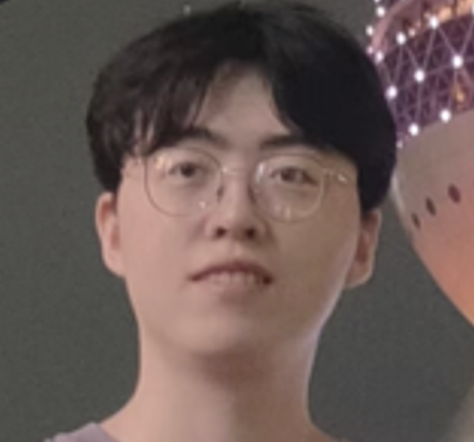
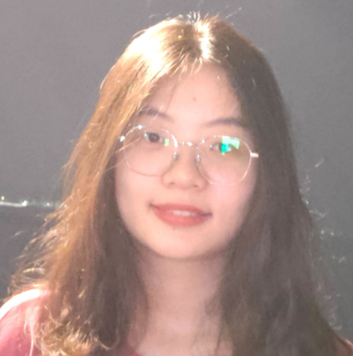
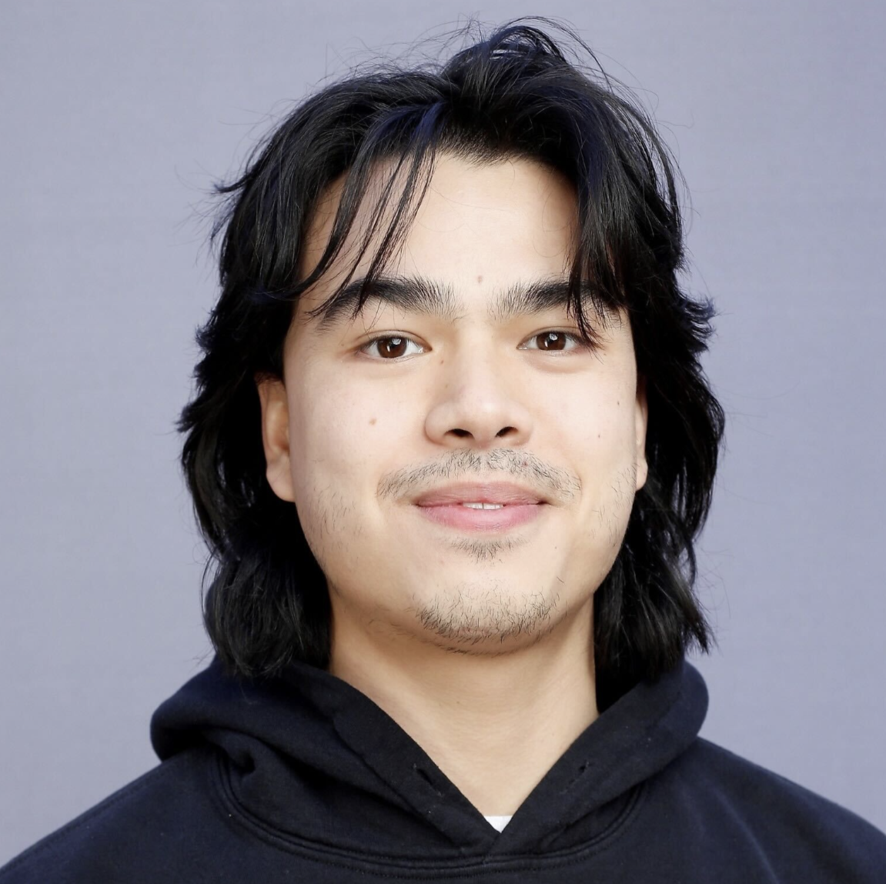
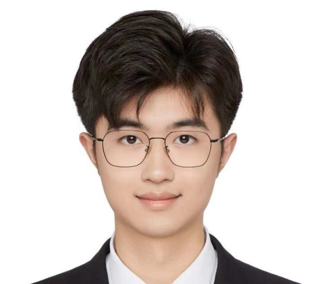
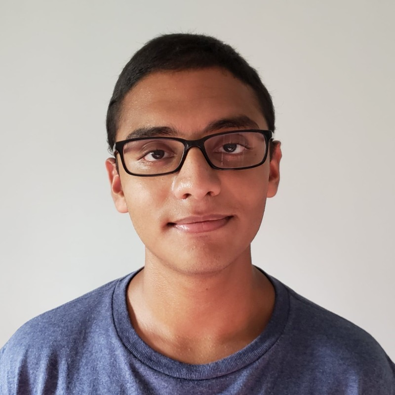
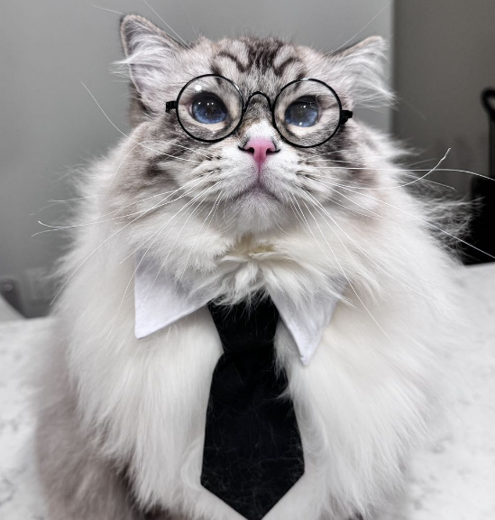

I am joining the [Computer Science Department of the University of Virginia](https://engineering.virginia.edu/department/computer-science/academics/graduate-programs/phd-computer-science) as an assistant professor starting August 2025. If you are interested in working with me as PhD students or grad/undergrad interns, please feel free to contact me with your resume: email **[yan.long AT virginia.edu]**

## Advisees  

- [Jiancong Cui](https://jiancongcui.github.io/) (PhD student at Northeastern University, since 2024) 

- [Hui Zhuang](https://zhuang-hui.github.io/) (PhD student at Northeastern University, since 2024) &nbsp; 

- [Christopher Pellegrini](https://www.linkedin.com/in/christopher-pellegrini-6a4226185/) (PhD student at Northeastern University, since 2024)  

- [Haozhe Weng]() (MS student at Zhejiang University, since 2024) &nbsp; &nbsp; &nbsp; 

- [Tobias Alam](https://www.linkedin.com/in/tobias-alam-5a4057215/) (CS undergraduate at University of Michigan, since 2022) &nbsp; &nbsp; &nbsp; 

## Lab Mascot  

- [Mr. Coconut]() (A two-year old who loves eating and sleeping)  &nbsp; &nbsp; 
