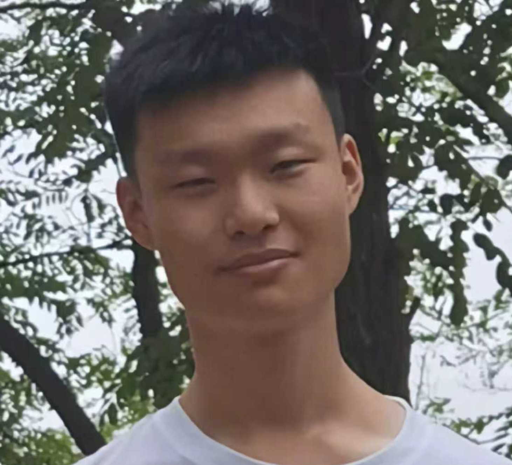

The <u>Sen</u>sing <u>Sec</u>u<u>r</u>it<u>y</u> and <u>P</u>rivacy <u>T</u>echnologies (**SenseCrypt**) Lab at the Hong Kong University of Science and Technology (Guangzhou) welcomes motivated researchers. The core mission of our lab is to advance the science and engineering of secure and privacy-preserving sensing and computation for protecting ground-breaking cyber-physical technologies and their users.  

__[26Fall - Recruiting PhD Students/RAs/Research Interns]__ I'm seeking talented students who are passionate about tackling research challenges in computer security and sensing. We welcome both in-person and remote interns.
<!-- The deadline for 25Fall [PhD application](https://fytgs.hkust-gz.edu.cn/admissions) is **July 15th, 2025**.  -->
Feel free to send me inquiries at: [yanlong@hkust-gz.edu.cn](mailto:yanlong@hkust-gz.edu.cn)  

## Current Advisees  

- [Zanyu Bao]() (PhD student at HKUST(GZ), since 2025) &nbsp; 

- [Pai Zheng]() (PhD student at HKUST(GZ), since 2025) &nbsp; 

- [Haoran Yan]() (PhD student at HKUST(GZ), since 2025) 

- [Yaxin Li]() (MPhil student at HKUST(GZ), since 2025) &nbsp; 

- [Shuhao Zhang]() (MPhil student at HKUST(GZ), since 2025) &nbsp; 

- [Jiancong Cui](https://jiancongcui.github.io/) (PhD student at Northeastern University, since 2024) 

- [Hui Zhuang](https://zhuang-hui.github.io/) (PhD student at Northeastern University, since 2024) &nbsp; 

## Past Advisees  

- [Tobias Alam](https://www.linkedin.com/in/tobias-alam-5a4057215/), UMich, M.S. Computer Science, 2022-2025
- [Christopher Pellegrini](https://www.linkedin.com/in/christopher-pellegrini-6a4226185/), NEU, Ph.D Cybersecurity, 2024-2025
- Haozhe Weng, ZJU, M.S. Electrical and Information Eng. 2024-2025
- [Nina Shamsi](https://scholar.google.com/citations?hl=en&user=uIrOBY8AAAAJ&view_op=list_works), NEU, Ph.D. Electrical and Computer Eng., 2023-2025
- [Sarah Bargfrede](https://www.linkedin.com/in/sarah-bargfrede-1428301b4/), UMich, B.S. Computer Science, 2023-2024
- [Jiaming Yao](https://www.linkedin.com/in/jiaming-yao-a0ab12219/), UMich, M.S. Data Science, 2023-2024
- [Emiko Sano](https://www.linkedin.com/in/emiko-sano/), High-school student, 2023-2024
- [Yumai Sun](https://www.linkedin.com/in/yumai-sun-49107b13b/), UMich, M.S. Electrical and Computer Eng., 2022-2023
- [Haoliang Cheng](https://www.linkedin.com/in/haoliang-cheng/), UMich, B.S. Computer Engineering, 2022-2023
- [Shivan Prasad](https://www.linkedin.com/in/shivan-sunny-prasad-b50376197/), UMich, B.S. Computer Science, 2021-2022
- Mia Li, UMich, B.S. Computer Science, 2020
- [Weikun Lyu](https://www.linkedin.com/in/weikun-lyu-725311196/) ,UMich, B.S. Computer Science, 2020

<!-- ## Lab Mascot  

- [Mr. Coconut]() (A two-year old ragdoll; food lover)  &nbsp; &nbsp;  &nbsp; &nbsp;  -->

## Thesis Committee/Jury
- [Mortaza HASSANI](https://www.linkedin.com/in/mortazahassani/), Cybersecurity MS Thesis @ Universite Libre de Bruxelles, 2025